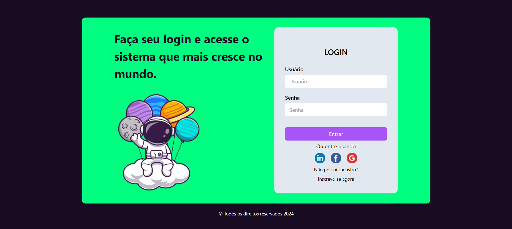

# Login Form ✅




### Este projeto implementa um formulário de login simples para autenticação de usuários. Ele pode ser usado como base para aplicações web que exigem login, como painéis de controle, sistemas de gerenciamento e outros tipos de software.

#### Funcionalidades para qual foi criado 😎

- Entrada para nome de usuário (username ou e-mail).

- Entrada para senha com mascaramento dos caracteres.

- Botão de login para submeter os dados.

- Mensagens de erro para credenciais inválidas.

- Integração com backend para verificação das credenciais (exemplo com PHP/MySQL ou outra linguagem).

#### Tecnologias Utilizadas

### Front-end


### Back-end (opcional)

#### recomendo usar essas tecnologias


### Como Usar

Clone este repositório para sua máquina local:

```
git clone https://github.com/seu-usuario/login-form.git

```

- Configure o backend (opcional):

- Certifique-se de que o servidor web (Apache, Nginx) e o banco de dados estão configurados.

- Crie uma tabela no banco de dados para armazenar as credenciais dos usuários.

```

CREATE TABLE usuarios (
    id INT AUTO_INCREMENT PRIMARY KEY,
    username VARCHAR(255) NOT NULL,
    password VARCHAR(255) NOT NULL
);

```

- Atualize as credenciais de conexão no código do backend (ex.: arquivo config.php).

- Inicie o servidor e acesse o formulário:

### Se estiver usando PHP:

php -S localhost:8000

- Abra o navegador e acesse http://localhost:8000.

- Teste o Login Form:

- Insira um nome de usuário e senha válidos.

- Verifique se a autenticação funciona corretamente.


## Lembre-se !!

### Não foram feitos testes de validação, apenas foi criado a parte  visual.

Estrutura do Projeto

```
login-form/
|-- assets/
    |-- icon/
        |-- facebook.png
        |-- linkedin.png
        |-- social.png
    |-- astronauta.png
    |-- instagram.png
|-- node_modules/
|-- style/
    |-- input.css      # Arquivos de estilização
    |-- output.css     # Arquivos de estilização
|-- LICENSE
|-- README.md
|-- image.png
|-- index.html         # Interface principal do formulário de login
|-- package-lock.json          
|-- package.json
|-- tailwind.config.js

# parte opcional do projeto

|-- backend/
    |-- login.php      # Lógica de autenticação no servidor
    |-- config.php     # Configuração de conexão ao banco de dados

```
## Contribuição

* Se quiser contribuir para este projeto:

- Faça um fork do repositório.

- Crie um branch para suas modificações:

```

git checkout -b minha-feature

```

- Submeta um pull request com a descrição das suas alterações.


# Obrigado 😎👍


